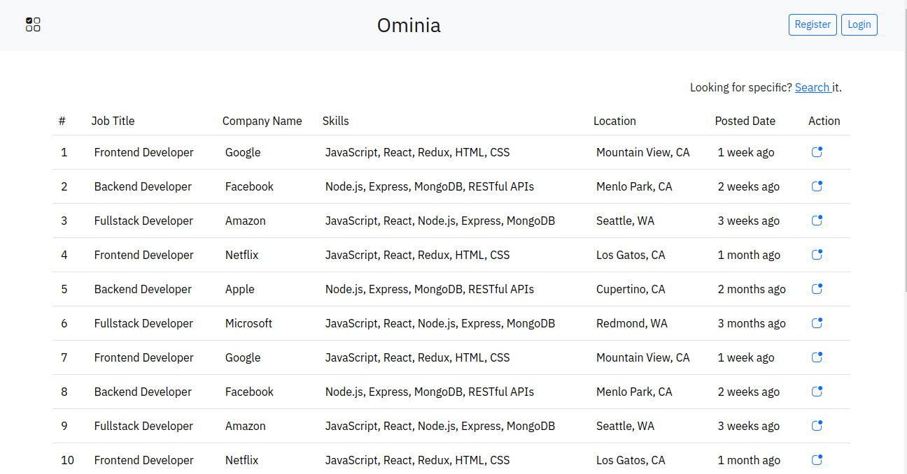
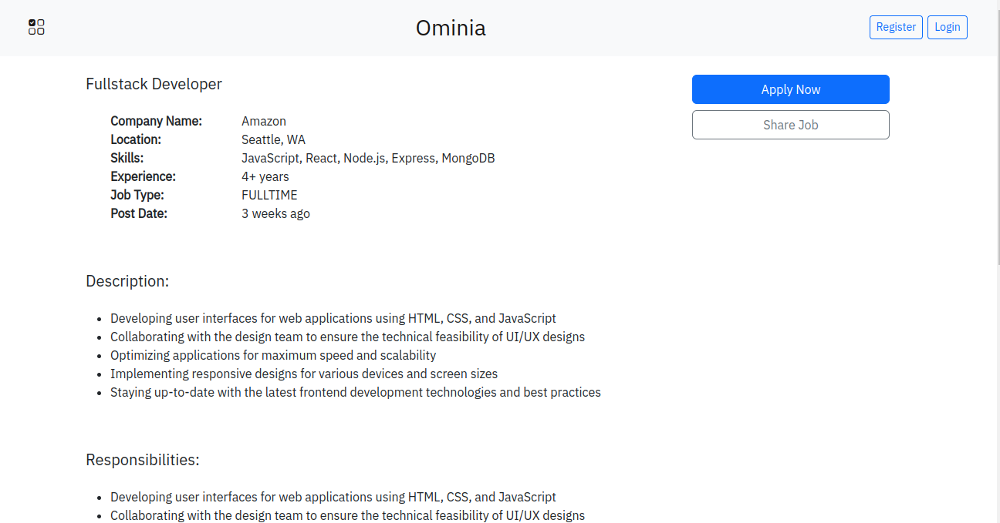
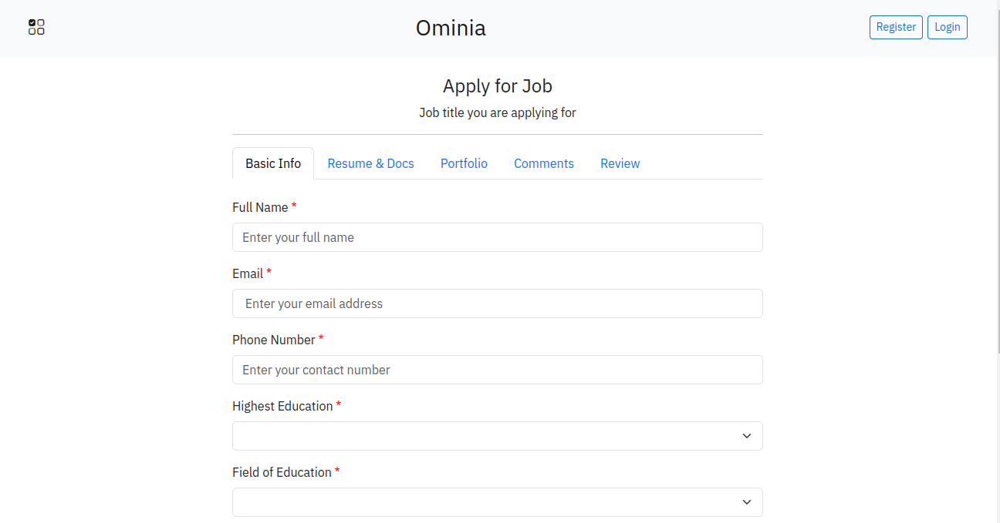
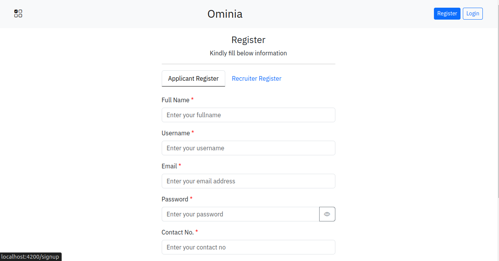

## Job Portal

### Overview
This is fullstack based job portal application for posting new jobs and finding some to apply for specific role and compnay. It is developed using `Spring Boot` and `Angular`.
As a recruiter after logged in you can post a new job and also can look at all your job posting with total application recieved for any job.
New applicant can apply to any job.

### Feature
- Listing of all jobs
- Description of a single job
- New job posting
- Apply form for any job
- User registeration and login (JWT)
- User profile for Applicant and Recruiter

### Technology
Backend
- Java
- Spring Boot
- Spring Security
- JWT

Frontend
- Angular 17
- Bootstrap 5

### Screenshots
 

TODOS:
- Access of resources/routing based on role, partially works
